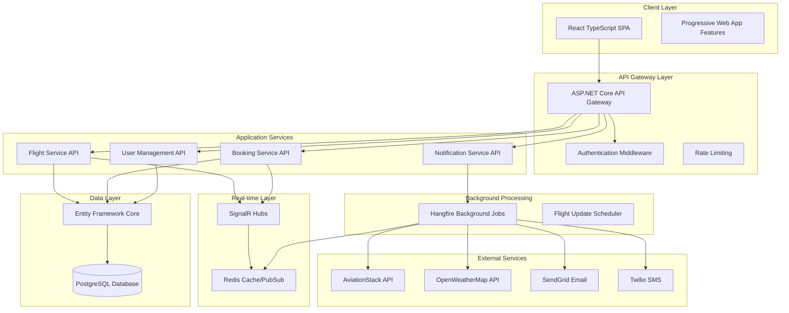

# Design Document

## Overview

The Airline Simulation Application is a full-stack web application built with ASP.NET Core backend and React TypeScript frontend. The system provides real-time flight tracking, booking management, and premium airline services through a microservices-inspired architecture with clear separation of concerns.

The application follows Domain-Driven Design principles with a clean architecture approach, ensuring maintainability and scalability. Real-time updates are handled through SignalR, while background processing uses Hangfire with Redis for caching and message queuing.

## Architecture

### High-Level Architecture



### Technology Stack

**Backend:**
- ASP.NET Core 8.0 Web API
- Entity Framework Core 8.0
- PostgreSQL 15+
- Redis 7.0+
- SignalR for real-time communication
- Hangfire for background jobs
- ASP.NET Core Identity for authentication

**Frontend:**
- React 18 with TypeScript
- React Router for navigation
- React Query for state management and caching
- CSS or SCSS for styling
- SignalR JavaScript client

**DevOps:**
- Docker containers
- Docker Compose for local development
- GitHub Actions for CI/CD

## Components and Interfaces

### Core Domain Models

```csharp
// Flight Domain
public class Flight
{
    public string FlightNumber { get; set; }
    public string Airline { get; set; }
    public Airport Origin { get; set; }
    public Airport Destination { get; set; }
    public DateTime ScheduledDeparture { get; set; }
    public DateTime? EstimatedDeparture { get; set; }
    public DateTime ScheduledArrival { get; set; }
    public DateTime? EstimatedArrival { get; set; }
    public FlightStatus Status { get; set; }
    public string Gate { get; set; }
    public string Terminal { get; set; }
}

// Booking Domain
public class Booking
{
    public string ConfirmationNumber { get; set; }
    public string UserId { get; set; }
    public Flight Flight { get; set; }
    public List<Passenger> Passengers { get; set; }
    public List<Seat> SelectedSeats { get; set; }
    public BookingStatus Status { get; set; }
    public PaymentInfo Payment { get; set; }
    public DateTime CreatedAt { get; set; }
}

// User Domain
public class ApplicationUser : IdentityUser
{
    public string FirstName { get; set; }
    public string LastName { get; set; }
    public string PhoneNumber { get; set; }
    public NotificationPreferences NotificationPrefs { get; set; }
    public LoyaltyAccount LoyaltyAccount { get; set; }
}
```

### Service Interfaces

```csharp
public interface IFlightService
{
    Task<IEnumerable<Flight>> GetFlightBoardAsync(string airportCode);
    Task<Flight> GetFlightDetailsAsync(string flightNumber, DateTime date);
    Task<WeatherInfo> GetWeatherAsync(string airportCode);
    Task UpdateFlightStatusAsync(string flightNumber, FlightStatus status);
}

public interface IBookingService
{
    Task<BookingResult> CreateBookingAsync(BookingRequest request);
    Task<Booking> GetBookingAsync(string confirmationNumber);
    Task<CheckInResult> CheckInAsync(string confirmationNumber);
    Task<SeatMap> GetSeatMapAsync(string flightNumber, DateTime date);
}

public interface INotificationService
{
    Task SendFlightUpdateAsync(string userId, FlightUpdate update);
    Task SendEmailAsync(string email, string subject, string body);
    Task SendSmsAsync(string phoneNumber, string message);
    Task SubscribeToFlightUpdatesAsync(string userId, string flightNumber);
}
```

### API Controllers

```csharp
[ApiController]
[Route("api/[controller]")]
public class FlightsController : ControllerBase
{
    [HttpGet("board")]
    public async Task<ActionResult<FlightBoardResponse>> GetFlightBoard(
        [FromQuery] string airport = "ORD",
        [FromQuery] string search = null,
        [FromQuery] FlightStatus? status = null)

    [HttpGet("{flightNumber}")]
    public async Task<ActionResult<FlightDetailsResponse>> GetFlightDetails(
        string flightNumber, 
        [FromQuery] DateTime date)

    [HttpGet("{flightNumber}/weather")]
    public async Task<ActionResult<WeatherResponse>> GetFlightWeather(
        string flightNumber, 
        [FromQuery] DateTime date)
}

[ApiController]
[Route("api/[controller]")]
[Authorize]
public class BookingsController : ControllerBase
{
    [HttpPost]
    public async Task<ActionResult<BookingResponse>> CreateBooking(
        [FromBody] CreateBookingRequest request)

    [HttpGet("{confirmationNumber}")]
    public async Task<ActionResult<BookingDetailsResponse>> GetBooking(
        string confirmationNumber)

    [HttpPost("{confirmationNumber}/checkin")]
    public async Task<ActionResult<CheckInResponse>> CheckIn(
        string confirmationNumber)
}
```

### SignalR Hubs

```csharp
public class FlightUpdatesHub : Hub
{
    public async Task JoinFlightGroup(string flightNumber)
    {
        await Groups.AddToGroupAsync(Context.ConnectionId, $"flight_{flightNumber}");
    }

    public async Task LeaveFlightGroup(string flightNumber)
    {
        await Groups.RemoveFromGroupAsync(Context.ConnectionId, $"flight_{flightNumber}");
    }
}

public interface IFlightUpdatesClient
{
    Task FlightStatusChanged(FlightStatusUpdate update);
    Task GateChanged(GateChangeUpdate update);
    Task FlightDelayed(DelayUpdate update);
}
```

## Data Models

### Database Schema

```sql
-- Users and Authentication
CREATE TABLE AspNetUsers (
    Id VARCHAR(450) PRIMARY KEY,
    FirstName VARCHAR(100) NOT NULL,
    LastName VARCHAR(100) NOT NULL,
    Email VARCHAR(256) NOT NULL,
    PhoneNumber VARCHAR(20),
    CreatedAt TIMESTAMP DEFAULT CURRENT_TIMESTAMP
);

-- Flights
CREATE TABLE Flights (
    Id SERIAL PRIMARY KEY,
    FlightNumber VARCHAR(10) NOT NULL,
    Airline VARCHAR(50) NOT NULL,
    OriginAirport VARCHAR(3) NOT NULL,
    DestinationAirport VARCHAR(3) NOT NULL,
    ScheduledDeparture TIMESTAMP NOT NULL,
    EstimatedDeparture TIMESTAMP,
    ScheduledArrival TIMESTAMP NOT NULL,
    EstimatedArrival TIMESTAMP,
    Status VARCHAR(20) NOT NULL,
    Gate VARCHAR(10),
    Terminal VARCHAR(5),
    Aircraft VARCHAR(50),
    CreatedAt TIMESTAMP DEFAULT CURRENT_TIMESTAMP,
    UpdatedAt TIMESTAMP DEFAULT CURRENT_TIMESTAMP
);

-- Bookings
CREATE TABLE Bookings (
    Id SERIAL PRIMARY KEY,
    ConfirmationNumber VARCHAR(6) UNIQUE NOT NULL,
    UserId VARCHAR(450) NOT NULL,
    FlightId INTEGER NOT NULL,
    Status VARCHAR(20) NOT NULL,
    TotalAmount DECIMAL(10,2) NOT NULL,
    PaymentStatus VARCHAR(20) NOT NULL,
    CreatedAt TIMESTAMP DEFAULT CURRENT_TIMESTAMP,
    FOREIGN KEY (UserId) REFERENCES AspNetUsers(Id),
    FOREIGN KEY (FlightId) REFERENCES Flights(Id)
);

-- Passengers
CREATE TABLE Passengers (
    Id SERIAL PRIMARY KEY,
    BookingId INTEGER NOT NULL,
    FirstName VARCHAR(100) NOT NULL,
    LastName VARCHAR(100) NOT NULL,
    DateOfBirth DATE,
    SeatNumber VARCHAR(5),
    SeatClass VARCHAR(20) NOT NULL,
    CheckedIn BOOLEAN DEFAULT FALSE,
    FOREIGN KEY (BookingId) REFERENCES Bookings(Id)
);

-- Notification Preferences
CREATE TABLE NotificationPreferences (
    Id SERIAL PRIMARY KEY,
    UserId VARCHAR(450) NOT NULL,
    EmailNotifications BOOLEAN DEFAULT TRUE,
    SmsNotifications BOOLEAN DEFAULT FALSE,
    FlightUpdates BOOLEAN DEFAULT TRUE,
    GateChanges BOOLEAN DEFAULT TRUE,
    FOREIGN KEY (UserId) REFERENCES AspNetUsers(Id)
);
```

### Entity Framework Configuration

```csharp
public class ApplicationDbContext : IdentityDbContext<ApplicationUser>
{
    public DbSet<Flight> Flights { get; set; }
    public DbSet<Booking> Bookings { get; set; }
    public DbSet<Passenger> Passengers { get; set; }
    public DbSet<NotificationPreferences> NotificationPreferences { get; set; }

    protected override void OnModelCreating(ModelBuilder builder)
    {
        base.OnModelCreating(builder);
        
        builder.Entity<Flight>(entity =>
        {
            entity.HasIndex(e => e.FlightNumber);
            entity.HasIndex(e => new { e.OriginAirport, e.ScheduledDeparture });
            entity.Property(e => e.ConfirmationNumber).HasMaxLength(6);
        });

        builder.Entity<Booking>(entity =>
        {
            entity.HasIndex(e => e.ConfirmationNumber).IsUnique();
            entity.HasMany(e => e.Passengers)
                  .WithOne(e => e.Booking)
                  .HasForeignKey(e => e.BookingId);
        });
    }
}
```

## Error Handling

### Global Exception Handling

```csharp
public class GlobalExceptionMiddleware
{
    public async Task InvokeAsync(HttpContext context, RequestDelegate next)
    {
        try
        {
            await next(context);
        }
        catch (Exception ex)
        {
            await HandleExceptionAsync(context, ex);
        }
    }

    private async Task HandleExceptionAsync(HttpContext context, Exception exception)
    {
        var response = exception switch
        {
            NotFoundException => new ErrorResponse 
            { 
                StatusCode = 404, 
                Message = "Resource not found" 
            },
            ValidationException validationEx => new ErrorResponse 
            { 
                StatusCode = 400, 
                Message = "Validation failed",
                Details = validationEx.Errors 
            },
            ExternalApiException apiEx => new ErrorResponse 
            { 
                StatusCode = 503, 
                Message = "External service unavailable" 
            },
            _ => new ErrorResponse 
            { 
                StatusCode = 500, 
                Message = "An unexpected error occurred" 
            }
        };

        context.Response.StatusCode = response.StatusCode;
        await context.Response.WriteAsync(JsonSerializer.Serialize(response));
    }
}
```

### Circuit Breaker Pattern for External APIs

```csharp
public class FlightDataService : IFlightDataService
{
    private readonly HttpClient _httpClient;
    private readonly ICircuitBreaker _circuitBreaker;

    public async Task<FlightData> GetFlightDataAsync(string flightNumber)
    {
        return await _circuitBreaker.ExecuteAsync(async () =>
        {
            var response = await _httpClient.GetAsync($"/flights/{flightNumber}");
            response.EnsureSuccessStatusCode();
            return await response.Content.ReadFromJsonAsync<FlightData>();
        });
    }
}
```

## Testing Strategy

### Unit Testing

```csharp
[TestClass]
public class BookingServiceTests
{
    private Mock<IBookingRepository> _mockRepository;
    private Mock<IFlightService> _mockFlightService;
    private BookingService _bookingService;

    [TestInitialize]
    public void Setup()
    {
        _mockRepository = new Mock<IBookingRepository>();
        _mockFlightService = new Mock<IFlightService>();
        _bookingService = new BookingService(_mockRepository.Object, _mockFlightService.Object);
    }

    [TestMethod]
    public async Task CreateBooking_ValidRequest_ReturnsBookingResult()
    {
        // Arrange
        var request = new BookingRequest 
        { 
            FlightNumber = "AA123", 
            Passengers = new List<PassengerInfo> { /* test data */ } 
        };
        
        _mockFlightService.Setup(x => x.GetFlightDetailsAsync(It.IsAny<string>(), It.IsAny<DateTime>()))
                         .ReturnsAsync(new Flight { /* test flight */ });

        // Act
        var result = await _bookingService.CreateBookingAsync(request);

        // Assert
        Assert.IsTrue(result.Success);
        Assert.IsNotNull(result.ConfirmationNumber);
    }
}
```

### Integration Testing

```csharp
[TestClass]
public class FlightControllerIntegrationTests : IClassFixture<WebApplicationFactory<Program>>
{
    private readonly WebApplicationFactory<Program> _factory;
    private readonly HttpClient _client;

    public FlightControllerIntegrationTests(WebApplicationFactory<Program> factory)
    {
        _factory = factory;
        _client = _factory.CreateClient();
    }

    [TestMethod]
    public async Task GetFlightBoard_ReturnsFlightData()
    {
        // Act
        var response = await _client.GetAsync("/api/flights/board?airport=ORD");

        // Assert
        response.EnsureSuccessStatusCode();
        var content = await response.Content.ReadAsStringAsync();
        var flightBoard = JsonSerializer.Deserialize<FlightBoardResponse>(content);
        
        Assert.IsNotNull(flightBoard);
        Assert.IsTrue(flightBoard.Flights.Any());
    }
}
```

### End-to-End Testing

- Playwright tests for critical user journeys
- Test scenarios: flight search, booking flow, check-in process
- Automated testing in CI/CD pipeline
- Performance testing with load simulation

### Frontend Testing Strategy

```typescript
// React component testing with React Testing Library
describe('FlightBoard Component', () => {
  test('displays flight information correctly', async () => {
    const mockFlights = [
      { flightNumber: 'AA123', airline: 'American', status: 'On Time' }
    ];

    render(<FlightBoard flights={mockFlights} />);
    
    expect(screen.getByText('AA123')).toBeInTheDocument();
    expect(screen.getByText('American')).toBeInTheDocument();
    expect(screen.getByText('On Time')).toBeInTheDocument();
  });

  test('filters flights by search term', async () => {
    render(<FlightBoard flights={mockFlights} />);
    
    const searchInput = screen.getByPlaceholderText('Search flights...');
    fireEvent.change(searchInput, { target: { value: 'AA123' } });
    
    await waitFor(() => {
      expect(screen.getByText('AA123')).toBeInTheDocument();
    });
  });
});
```

This design provides a robust, scalable architecture that addresses all the requirements while following modern development practices and patterns. The system is designed for maintainability, testability, and performance.